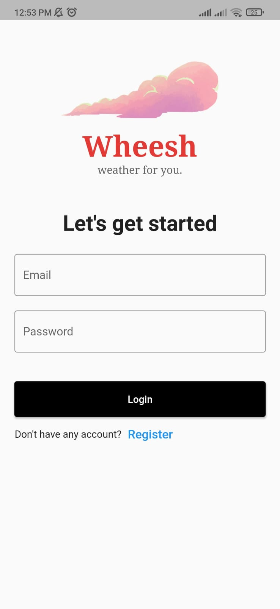
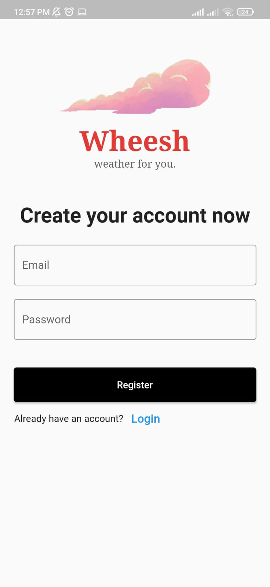
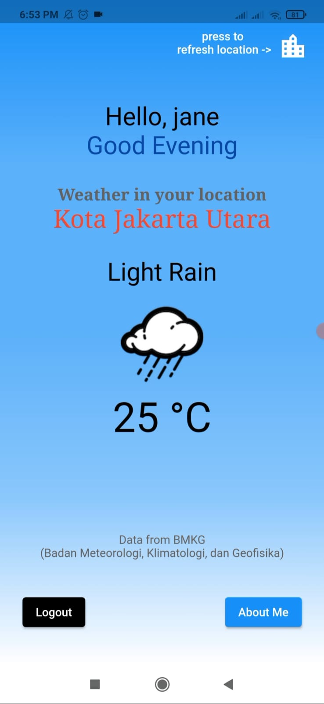

# wheeshapp-weather
Weather mobile App for Indonesia, with geolocator plugin and API from BMKG (Badan Meteorologi, Klimatologi, dan Geofisika).

    Developed with Flutter
## App Appearance
### Login and Register Screen

  
   

### Main Screen

  

